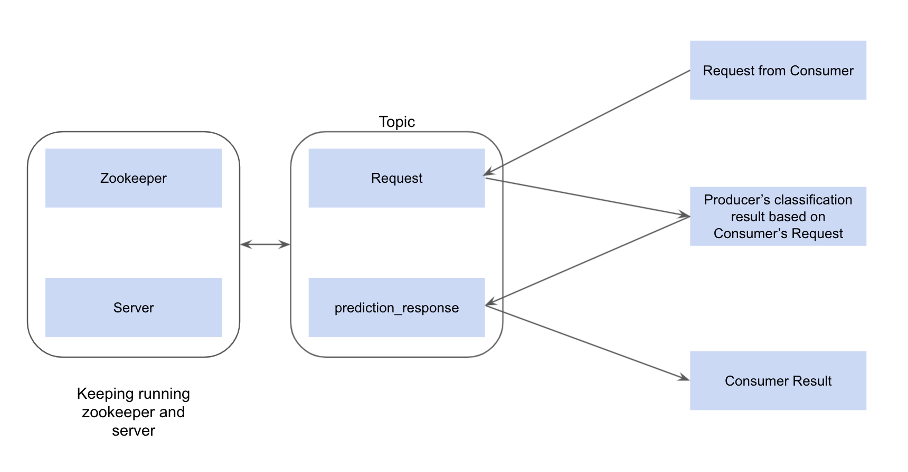

# Mnist_Fashion

## Part 1

To train the CNN model in Part_1 the image array should be of (batch_size x width x height) For Example: to train MNIST (60000 x 28 x 28)

If your image is like MNIST follow the below steps

```
import pandas as pd
import numpy as np
from train import train

train_df = pd.read_csv('data/train_data.csv')
test_df = pd.read_csv('data/test_data.csv')
y_train = train_df['Label'].values
x_train = train_df.drop('Label', axis=1)
y_test = test_df['Label'].values
x_test = test_df.drop('Label', axis=1)
x_train = np.reshape(x_train.values, (len(x_train), 28, 28))
x_test = np.reshape(x_test.values, (len(x_test), 28, 28))
print('Number of Train Images: '+str(len(x_train)))
print('Number of Test Images: '+str(len(x_test)))
print('Number of Classes in Trian_images: ' + str(len(np.unique(y_train))))
print('Number of Classes in Test_images: ' + str(len(np.unique(y_test))))


train(x_train[:10], y_train[:10], x_test[:5], y_test[:5], epochs=1, model_folder_path='models'). 
```

## Part_2

Sends some random number from producer which will be received on consumer side.

## Part 3 

